## The Analytic Impulse

## ANDREW DUNCAN**

Cerwin-Vega! Inc., Simi Valley, CA 93065, USA

A complex analytic function is to its real part as a solid object is to its shadow. The analytic impulse △(t) is a complex "function" whose real part is the familiar Dirac symbol δ(t). This impulse finds application in energy-time calculations. The nature of this impulse and its application to finding energy-time curves are examined in the continuous, z-transform, and DFT domains. A simple window is also discussed which leads to a smoother impulse $\tilde{\Delta}(t)$.

## 0 INTRODUCTION

The analytic impulse △(t) is the complex-valued extension of the real-valued function δ(t) [1]. Its real part is that same delta; its imaginary part will be examined further. This function finds one application in audio in the calculation of the energy-time curve (ETC) [2], [3] of a system. To summarize this idea briefly, the ETC is the envelope (as opposed to the magnitude) of the impulse response. To find that envelope, we combine the magnitude of the impulse response in an rms fashion with the magnitude of its Hilbert transform. The complex (or quadrature) sum of the impulse response with its Hilbert transform is called the analytic impulse response (AIR) of the system, and the ETC is the magnitude of the AIR.

The motivation for using the ETC derives from the utility of envelopes in eliminating interference effects that appear in the time domain. Fig. 1 shows the impulse response of a simulated system. It is composed of two damped sinusoids, a high-amplitude oscillation that dies away rapidly and a delayed lower amplitude one that lingers. Because of interference it is not easy to discern this visually. Using the techniques described in this paper we find the ETC (Fig. 2). In this graph the information we want is easy to see. However, we note that the energy-time graph is noncausal, that is, it starts to leap up before t=0, in opposition to our intuitive notions about what such a curve should mean. We will see that in finding such a curve there is an inevitable smearing of impulses in the time domain, and that what is happening is that the sharp rise at t=0 is actually "leaking backward."

*Presented at the 81st Convention of the Audio Engineering Society, Los Angeles, 1986 November 12-16; revised 1987 December 29.

**Present address: Department of Mathematics, University of California, Santa Cruz, CA 95064.

## 1 THE MECHANICS

Here we describe the mechanism of finding the ETC and discuss the utility of △(t) in carrying out the procedure. In the following sections we justify the procedure and investigate the nature of △(t) in the different domains. To find the AIR of a system, given its impulse response, we use (r) in one of two equivalent ways:

- 1) We multiply the system's frequency response by the spectrum of △(t) and then perform an inverse transform (Fourier, 2, or DFT), which gives us the AIR in the time domain.
- 2) We convolve the system's impulse response with △(t), which yields the AIR.

Fig. 1. Superposition of two damped sinusoids with different attack times.

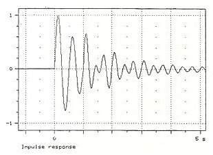

If we let h(t) be the system's impulse response and H(f) its frequency response, we have

$$A I R ( t ) = \mathcal { F } ^ { - 1 } \{ \mathcal { F } \{ \Delta ( t ) \} \, H ( f ) \} \tag{1a}$$

$$= \Delta ( t ) \ast h ( t ) \ .$$

The term AIR can be parsed in two different ways. For linear systems the two interpretations are identical. We introduced the AIR above as the analytic "impulse response, " a complex function whose real part is the impulse response. This interpretation follows (roughly) analytic impulse" response, the (complex) response of a system to a complex impulse, namely, △(t). This interpretation corresponds to Eq. (1b). In this light, △(t) appears as the AIR of an ideal system. This is to say, the function △(t) plays a dual role. From one perspective it is the tool we use to calculate the AIR for a given system. But at the same time, we may regard it as the data itself, the response of a system with everywhere flat frequency response.

From the AIR it is a short step to the ETC. The AIR is a complex function of a real variable (time). Its real part is the impulse response of the system in question, and its imaginary part turns out to be the Hilbert transform of the impulse response. The ETC, a real nonnegative function of time, is the magnitude of the AIR. For example, the ETC of an ideal system will be the magnitude of △(t). For this reason an investigation of the nature and properties of △(t) proves to be very useful. We start with the purely real predecessors of △(t).

Fig. 2. ETC of function of Fig. 1.

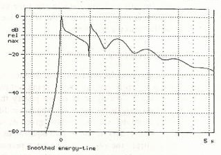

## 2 THE DELTA FUNCTIONS

It is generally considered desirable to have symmetry in one's equations. For instance, we introduce negative numbers so we might say there is exactly one solution of a linear equation. Further, we admit complex numbers so that every nth-order polynomial has exactly n zeros. In this spirit we create δ(t) so that the Fourier transform will have a kernel: a function whose image under the mapping is a unit constant. Fig. 3 shows this relation, with the double arrow indicating the direction of the forward transform. Intuitively, S(t) is a narrow pulse As it has positive but no negative values, it has a dc component. Since it rises and falls very rapidly, it has a great deal of high-frequency energy. Following the precedent of referring to negative or imaginary "numbers, I will call δ(t) and its relatives functions, although strictly speaking this is not correct. This function can be thought of as the limit of a sequence of (true) functions, as the derivative of the unit step function, or in distinctive ways. In the discrete-time domains, the difficulty of a rigorous delta function is gone. In the time domain of the z transform (Fig. 4) we have a well behaved infinite sequence, zero everywhere except at one sample. In the discrete Fourier transform (DFT) domain (Fig. 5), time is implicitly periodic, and so we have a finite, cyclic sequence. We refer to a circular plot of a cyclic function, such as in Fig. 5, as a Bracewell ring [4, p. 363]. To stress the quantized nature of the independent variable, we use square brackets, and call the variable . takes on only integer values. In the discrete frequency domain, we shall use the letter v,

Fig. 3. Dirac delta function and its spectrum.

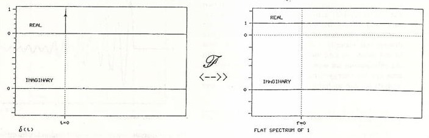

## 3 ANALYTIC FUNCTIONS

An analytic function is to its real part as a solid object is to its shadow. For example, consider the function cos(wt). The complex extension of cos(wt) is

$$e ^ { j \omega t } = \cos ( \omega t ) \, + \, j \, \sin ( \omega t ) \, .$$

In a way, $e^{j\omega t}$ is the most continuous complex function we can find with cos(ωt) as its real part. Fig. 6 shows the solid figure that results when both parts of the function are plotted against time. The figure's projections show both the real and the imaginary parts as functions of time. The rear projection plane shows the function

Fig. 4. Discrete-time infinite-sample delta function $\delta\_\infin [t]$.

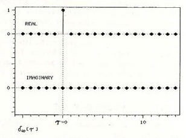

plotted on the complex plane, with time as a parameter (a Nyquist diagram). Henning Moller refers to Nyquist diagrams of loudspeaker impedance plots as Heyser spirals, after the graphs that Richard Heyser used in Audio magazine to analyze loudspeaker performance. Following that line, we used to refer to such graphs as shown in Fig. 6 as generalized Heyser spirals, but the term proved too formal and cumbersome and has been shortened to Heyser corkscrew. Similar three-dimensional plots have also been used by Heyser [2].

The magnitude of cos(wt) varies from -1 to +1 and at times it is zero. However, we feel that its envelope is constant. Our intuition is satisfied by defining the envelope to be the magnitude of the full complex function $e^{j \omega t}$. In a Heyser corkscrew this magnitude appears as the radial distance of the central figure to the time axis. From Fig. 6 it is clear that the envelope of cos(ωt) is always 1. A plot of this radius as a function of time is the ETC of the function.

Fig. 5. Discrete-time finite-sample delta function $\delta\_{64}[\tau]$ for 64-point DFT in Bracewell ring format.

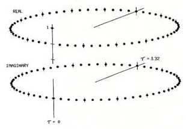

Fig. 6. Heyser corkscrew of ej.

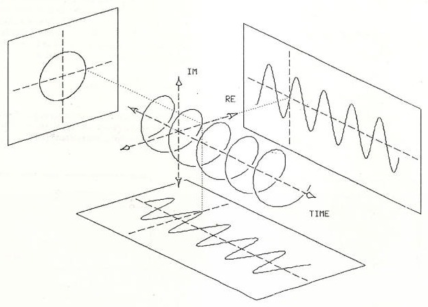

The connection between the real and imaginary parts is called the Hilbert transform. The connection between the real part and the whole is best illustrated by examining the relation.

$$\cos ( \omega t ) = \frac { e ^ { j \omega t } + e ^ { - j \omega t } } { 2 }$$

which is an inversion of Eq. 2. To get the complex extension of cos(wt) we express it in its exponential form, suppress the negative frequency term ej, and double the positive frequency part, as shown in Fig. 7. This complex-valued function whose real part is the original function of time is called the analytic signal, although this is something of a misnomer, as noted below. Any real function of time will have a spectrum that is two-sided and symmetric. To get the analytic signal, we go into the frequency domain, remove the negative-frequency components, and double the result (except at the dc point). This corresponds to performing the operation in Eq. (la), where {△(t)}, the spectrum of △(t), is a function that has a value of O for negative frequencies, 1 for dc, and 2 for positive frequencies. Performing this operation is referred to as causalizing the spectrum. In this way, the term causal has been generalized to refer to a function that is zero for negative argument. If the argument is time, this corresponds to conventional usage. In fact, as we shall see, a function cannot be causal in both time and frequency.

Fig. 7. Spectra of cos(2πt) and ej

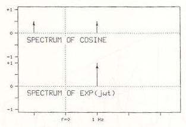

As a matter of nomenclature, the term analytic refers to a complex function of a complex variable that has a special smoothness property, that of being everywhere differentiable. In principle, given a reasonably smooth real function of a single variable, there is a unique analytic function whose real part along a specified axis is the same as the original function. One finds this analytic function by first applying the Hilbert transform and then integrating the Cauchy-Riemann equations to extend the function to the entire complex plane. In the process described, we stop short of finding the entire analytic continuation of our signal, but the term analytic signal has behind it the inertia of history. The notion of an analytic signal as one with no negative-frequency terms will also be used in the discrete domains, where the concept of differentiability is meaningless.

## 4 THE CONTINUOUS DOMAINS

In the continuous domains we may say, in light of the foregoing, that if the real impulse δ(t) is a signal with a flat spectrum of 1, then the analytic impulse Δ(t) is a signal with a spectrum that is zero for negative frequencies, 1 for dc, and 2 for positive frequencies. This is correct, but it will be more illuminating to approach this limit slowly. Fig. 8 shows a signal that has positive and negative frequency content only up to Hz (that is, a bandwidth of 1 Hz and a unit area). The algebraic expression of this signal is

$$f ( t ) = \frac { \sin ( \pi t ) } { \pi t } \, = \, \sin ( t ) \, .$$

If we remove the negative-frequency components, we get a transform pair as in Fig. 9, shown in both linear and logarithmic phase-magnitude (ETC) displays. This function is given by

Fig. 8. Sinc(t) and its spectrum.

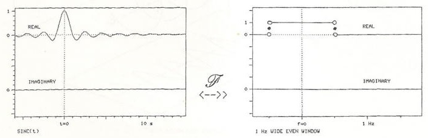

$$\begin{aligned} f ( t ) & = \frac { \sin ( \pi t ) } { \pi t } + j \, \frac { 1 - \cos ( \pi t ) } { \pi t } \\ & = \left [ \frac { e ^ { j t } - 1 } { \pi t } \right ] ^ { * } \\ & = \sin ( t ) + j \cdot \cos ( t ) = \, \text {asinc} ( t ) \, . \quad ( 5 a ) \end{aligned}$$

$$( 5 a )$$

This function is sometimes also described as [4, p. 391]

$$\text {asc} ( t ) \, = \, \text {inc} ( t ) \, + \, j \, \cdot \, \text {inc} ( t / 2 ) \, \sin ( \pi t / 2 ) \tag{5b}$$

a form which, if studied, will reveal certain convolution properties of the imaginary part. In Fig. 10 we see the same function and note its helical form.

Passing to the limit, we let the band edge move indefinitely to the right, giving us the transform pair shown in Fig. 11. The spectrum is now a function called CAUS(f) and the signal is the continuous analytic impulse,

$$\begin{aligned} \Delta ( t ) & = \delta ( t ) + j \, \frac { 1 } { \pi t } \\ & = \delta ( t ) + j \cdot d ( t ) \end{aligned}$$

We see immediately that the imaginary part of △(t), sometimes referred to as a doublet or d(t), is not causal, and hence the magnitude of △(t) [the ETC of δ(t)] on the upper left hand of Fig. 11 must also be noncausal. In Appendix I there is a further discussion of why d(t) does not vanish for nonzero argument. For the moment, as the magnitude of △(t) represents the ETC of an ideal system, we may conclude that the ETC of any loudstrength in the continuous and discrete domains. Although the evidence for this is plentiful [2], [4]-[6], it appears only in fragments, in widely scattered texts, usually addressing very different topics. Further, there is some confusion about the necessity of this effect. Perhaps the resolution of our instruments is too low, or maybe a more sophisticated windowing would make our ETC start at t=0. The foregoing analysis shows that this is not so in continuous domains. The following addresses the same issue in the discrete domains.

## 5 THE Z-TRANSFORM DOMAINS

Our next step is to make time discrete, that is, we now know the value of the signal at integer multiples of a sampling interval. Without loss of generality we can replace t with , an integer variable. There are still an infinite number of samples, but now a countable infinity. The effect of sampling in time is to make the spectrum periodic. In fact, the spectrum is now the z transform evaluated on the unit circle. Fig. 12 shows CAUS(f) for this situation and its inverse transform

Fig. 9. Analytic sinc function asinc(t), its ETC, and its spectrum.

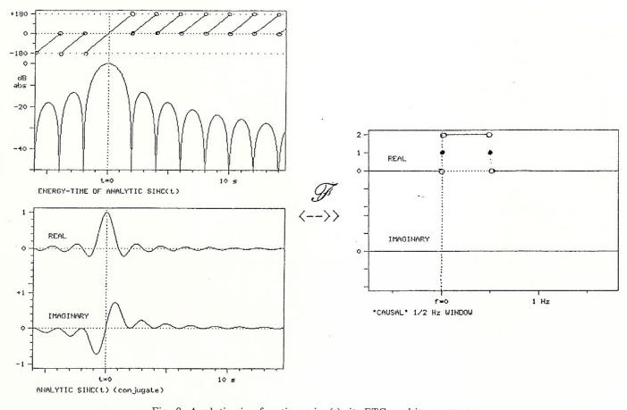

Fig. 10. Heyser corkscrew of asinc(t).

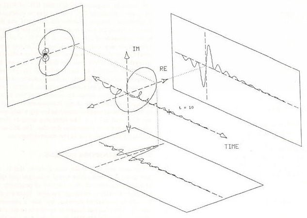

Fig. 11. Continuous-time analytic impulse time infinite-sample analytic impulse], its ETC, and its spectrum.

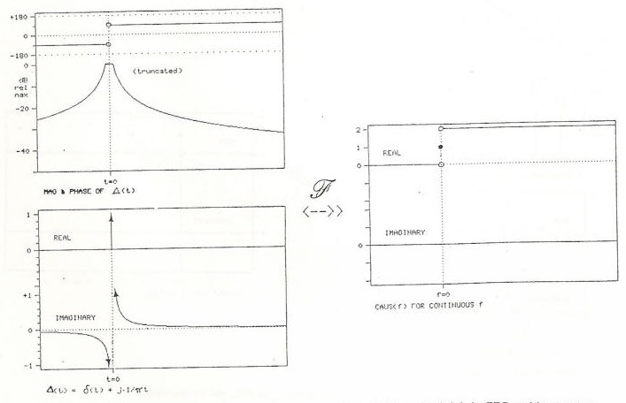

J. Audio Eng. Soc., Vol. 36, No. 5, 1988 May

$\Delta\_\infin[\tau]$. In algebraic form [5, p. 360], [6, p. 71],

$$\begin{aligned} \Delta _ { \alpha } [ \tau ] & = \frac { \sin ( \pi \tau ) } { \pi \tau } + j \, \frac { 1 \, - \, \cos ( \pi \tau ) } { \pi \tau } \\ & = \left [ \frac { e ^ { j \pi \, \pi } - 1 } { \pi \tau } \right ] ^ { * } \end{aligned}$$

or, equivalently,

$$A _ { \mathbb { Z } } [ \tau ] \equiv \begin{cases} 1 , & \tau = 0 \\ j \frac { 2 } { \pi \tau } , & \tau \text { odd} \\ 0 , & \tau \text { even, } \neq 0 \end{cases}$$

Now let us compare Eqs. (5a) and (7a). We see that in this "intermediate" domain of quantized time and continuous frequency the analytic impulse has exactly the same form as the completely continuous impulse before limiting. One only need write a T where t would normally appear. Fig. 13 is an overlay of Figs. 9 and 12 and shows even more clearly what Eq. (7b) tends to obscure: $\Delta\_\infin[\tau]$ is just a sampled version of the analytic sinc function. However, we see that Eq. (7b) is reminiscent of Eq. (6). The sudden appearance of the factor 2 in the imaginary part can be explained by noting that $d\_\infin [\tau]$ alternates between 0 and 2/π, thus giving an average value of 1/π (see also Appendix I).

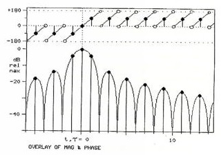

Fig. 13. Overlay of Figs. 9 and 12.

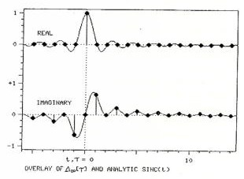

Fig. 12. Discrete-time infinite-sample analytic impulse $\Delta\_\infin [\tau]$, its ETC, and its z transform evaluated on unit circle.

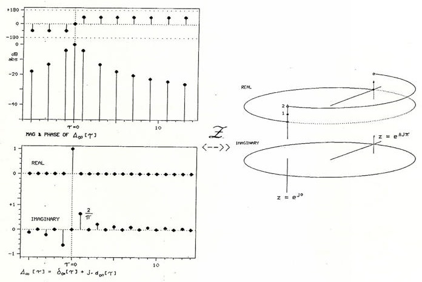

If we step back from Fig. 12 and enlarge our field of view, we get a picture like Fig. 14. This figure shows that it takes roughly 60 samples for the envelope of even the briefest transient to decay to 40 dB below the peak value. This suggests that there is a practical limit to the resolution of an energy-time measurement made with sampled signals.

## 6 THE DFT DOMAINS

Our final step, one that is well justified by the demands of physical reality, is to consider only a finite number of signal samples. This final restriction changes the spectrum from periodic continuous to periodic discrete. The discrete nature of the spectrum, in turn, forces us to conclude that the time function is implicitly periodic. Now both domains are again of the same form. The number of samples N is the same for both signal and spectrum.

Fig. 14. Wider view of Fig. 12.

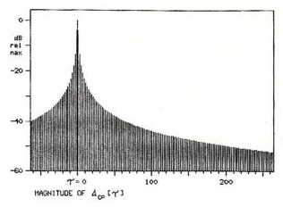

We cannot now expect $\Delta\_N[t]$ to have the same algebraic form as $\Delta\_\infin[T]$. What was 𝜏=±∞. now corresponds to 𝜏=±N/2, the antipodal point. Eqs. (7a) and (7b) need to be modified in order that the envelope of △[𝜏] vanishes at this point. In fact,

$$\begin{aligned} \Delta _ { N } [ \tau ] & = \frac { 1 } { N } \left [ 2 e ^ { j 2 \pi / N } \frac { 1 - e ^ { j \pi \tau } } { 1 - e ^ { j 2 \pi / N } } + ( 1 - e ^ { j \pi \tau } ) \right ] \\ & = \begin{cases} 1 , & \tau = 0 \\ j \frac { 2 } { N } \cot \left ( \frac { \pi \tau } { N } \right ) , & \tau \text { odd} \quad [ 5 , p . 3 5 ] \\ 0 , & \tau \text { even } \neq 0 \end{cases} \end{aligned}$$

which is shown in Fig. 15. This looks very different from Eq. (7). The difference in form between Eqs. (7) and (8) was one initial stimulus to my investigations: However, these two equations are numerically almost identical. For example, in the 64-point DFT domain, the first nonzero value of d64[T] is cot(π/64)/32=0.6361 ... In the infinite-point z-transform time domain we have $d\_\infin[\tau]=2/\pi=0. 6366..$, which differs by less than 0. 1%. Because of this, Fig. 14 and the upper left of Fig. 12 may serve as ETCs for the analytic impulse in the DFT domains for large N. Any measurement technique that yields information about signal and spectrum that is restricted to discrete samples, and this includes both FFT (a particularly efficient way of doing a similarly limited resolution.

## 7 WINDOWING

Thus the analytic impulse, discrete or continuous, has a magnitude that does not vanish for negative time. Equivalently the ETC for the ideal transducer, to say

Fig. 15. Discrete-time finite-sample analytic impulse $\Delta\_{64}[\tau]$, its ETC, and its spectrum for 64-point DFT.

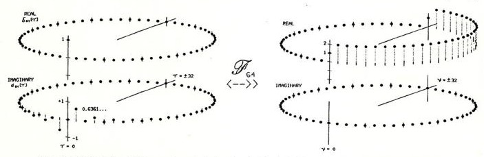

nothing of the practical one, is not causal. This means that the interpretation of that envelope as a graph of energy versus time is only approximate. The best we can do is ask: what can we do to make such a graph look better? For example, we may make the skirts of a peak steeper, to help us visually sort closely spaced peaks, at the expense of making the peaks themselves somewhat broader. This is obviously a tradeoff, and if desired it can be accomplished with techniques of windowing.

By windowing we mean the multiplication in the time or frequency domain of a measured function by another function, called the window. Generally the window goes to 0 where the data are to be deemphasized, and to 1 where the data are to be emphasized. For example, a cosine-squared (or raised-cosine) bell, called a Hann window after Julius von Hann, is one of the most common windows used in FFT processing. Fig. 16 shows a Hann window in a 64-point DFT domain. The particularly simple form of this function in a periodic domain is revealed by the Bracewell ring format.

We first investigate the effect of windowing on the analytic impulse itself. We will later see that the windowed impulse or its spectrum may be used to find a windowed ETC for physical data. To window x[], we multiply its spectrum by a cosine-squared shape. The value of the window is 0 at the two edges of[]'s spectrum and I at the center. The results of this windowing are shown in Fig. 17. The algebraic expression for this smoothed analytic impulse is

$$
\tilde{\Delta}_x[\tau] =
\begin{cases}
\left.
\begin{array}{ll}
\frac{1}{2}, & \tau = 0 \\
-\frac{1}{4}, & \tau = \pm 2 \\
0, & \text{elsewhere}
\end{array}
\right\rbrace
& \text{real part}
\\
\\
\left.
\begin{array}{ll}
0, & \tau \text{ even} \\
\frac{1}{\pi}\frac{-4}{\tau(\tau+2)(\tau-2)}, & \tau \text{ odd}
\end{array}
\right\rbrace
& \text{imaginary part}
\end{cases}
$$

The real part of the impulse has become more spread out, but the imaginary part is more localized, and as a result the magnitude peak has narrower skirts, but is more broad at the top. Fig. 18 shows a wide view of the magnitude, over the same range as Fig. 14, and Fig. 19 gives a still wider view.

This window may be applied to real-life data in the DFT domains. Fig. 20 shows the smoothed analytic impulse and its spectrum for a 64-point DFT. As before, the numerical difference between infinite- and finite-sample domains is very small.

To find the smoothed envelope of a measured impulse response, we may use an argument similar to the one

Fig. 16. Hann window HANN[x]=cos²（πx/N)=½[1+ cos(2mx/N]) for 64-point DFT.

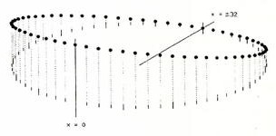

in Sec. I and say that the smoothed "analytic impulse response" is the same as the "smoothed analytic impulse" response. Algebraically,

$$
\begin{aligned}
\text{smoother AIR}(t)
&= \mathbb{F}^{-1} \left\lbrace \mathcal{F}\{\Delta(t)\}[W(f)H(f)] \right\rbrace \\
&= \mathbb{F}^{-1} \left\lbrace [\mathcal{F}\{\Delta(t)\}\,W(f)] H(f) \right\rbrace \\
&= \mathbb{F}^{-1} \left\lbrace \mathcal{F}\{\widehat{\Delta}(t)\} H(f) \right\rbrace \\
&= \widetilde{\Delta}(t) \ast h(t) \quad (10)
\end{aligned}
$$

where W(f) is the window function. Equivalently, smoothing merely involves substituting (t) (or one of its discrete relatives) for △(t) in the usual equations for finding the AIR.

The art of windowing consists of picking a window that best embodies the desired tradeoffs between smoothness and resolution. The Hann window shown is one of the most elementary of these. Other windows of interest include the Hann squared, the Blackmun, and the Kaiser. For futher discussion, see, for example, [6].

## 8 RESOLUTION

The simplest description of resolving power in an ETC is the width of a spike caused by a delta function in the impulse response. For example, without smooth-

Fig. 17. Smoothed discrete-time infinite-sample analytic impulse [], its ETC, and its z transform evaluated on unit circle.

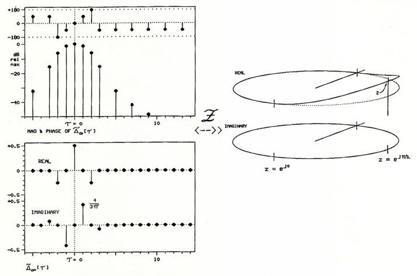

Fig. 18. Magnitude of [T] on 60-dB scale.

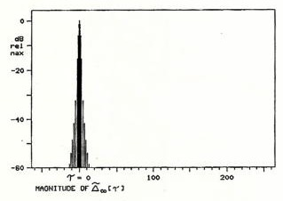

Fig. 19. Magnitude of △[T] on 180-dB scale.

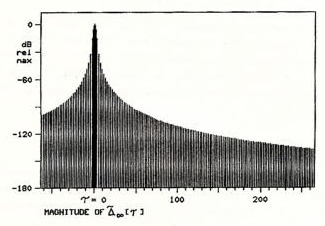

ing, the -30-dB width is 42 samples in time; with the smoothing discussed, it is 10 samples. With the typical experimenter's lab equipment, the total number of samples N is fixed, and the equipment's display window or printout will show the data samples spaced at equal intervals so as to fill the space allotted. In particular, changing the equipment's frequency range or sampling window will not change the spacing of samples in the display. In this case a peak in ETC will have a width that is a constant fraction of the display width, regardless of frequency setting. In other words, if the experimenter turns up the sampling rate on the lab FFT in hopes of narrowing the apparent width of a peak in the energy-time function, it will have no effect. However, in terms of absolute time, the peak will be narrower since the entire display will now cover a smaller interval of time.

## 9 EXAMPLES

Fig. 21 shows the ETC of a high-quality tweeter, measured with a 1024-point FFT sampling at 256 kHz, with no weighting and 256 averages (necessary due to a noisy "anechoic" chamber). In Fig. 22 the above-mentioned windowing has been used on the spectrum before finding the ETC. The smoothed ETC has a sharper attack, and some secondary peaks that were "riding" on the skirts of the first peak are now lower down. However, the smoothed ETC also has a wider peak, which seems to absorb a neighboring peak.

Of particular interest is the peak at 160 μs, which shows up clearly in the smoothed function, but not in the unsmoothed one. This corresponds to a path difference for a sound wave of roughly 5 mm, which is the distance to the edge of the (unmounted) tweeter flange, where the acoustic load changes from a half space to a full space. An experimenter with access to this ETC might suspect that the outgoing acoustic impulse is partially refracted at the edge of the flange, reaching the microphone having traveled 50 mm farther than the direct signal. In an attempt to verify this guess, the measurement was repeated with the tweeter mounted at the end of a long tube of sound-absorbent material. Fig. 23 shows the smoothed ETC for this measurement, with the refraction gone.

## 10 CONCLUSIONS

In any domain we might care to use, the ETC of a system, calculated as the envelope of the impulse response, is noncausal. This is not a problem of physics or engineering, but a necessary consequence of the mathematics involved. The problem arises when we insist on using the math to describe a physical process we know to be causal in time. To interpret our findings, we must know where it is that the numbers stop talking about the real world, and (like historians) start talking about each other.

We may investigate this numerical discourse mathematically by the judicious selection of theoretical functions to represent prototypical physical measurements. The convolution properties enjoyed by δ(t) make it an excellent choice for this purpose. Since the set {δ(t-a)} forms an orthonormal basis for a wide class of functions, a discussion of signal-processing techniques applied to δ(t) alone will have a much wider applicability. Further, δ(t) may itself be viewed as a physical measurement: the impulse response of an ideal system.

From δ(t) we expanded our consideration to the fully complex △(t), and we investigated theoretically the properties of the envelope of a general or nonideal system's impulse response. △(t) appears both as a tool for finding this envelope and as an ideal measurement itself: a benchmark to be compared with expectations or actual measurements. We have seen how the mathematical process of windowing may make visual interpretation of that envelope easier. Since graphic display is generally the ultimate destiny of numerical calculation, windowing appears as a fundamental tool for such processing.

## 11 ACKNOWLEDGMENT

I would like to give special thanks to Dr. Marshall Buck and Eugene Czerwinski for their support and en-

Fig. 21. ETC of high-quality tweeter, measured with 1024-sample FFT sampling at 256 kHz; no weighting.

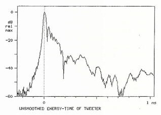

Fig. 22. ETC for same tweeter as in Fig. 21, but with raised-cosine smoothing in frequency domain.

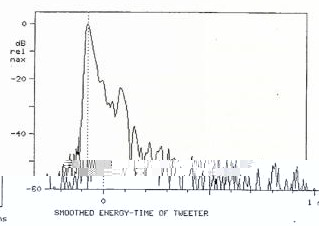

Fig. 20. Smoothed discrete-time finite-sample analytic impulse ] and its spectrum for 64-point DFT.

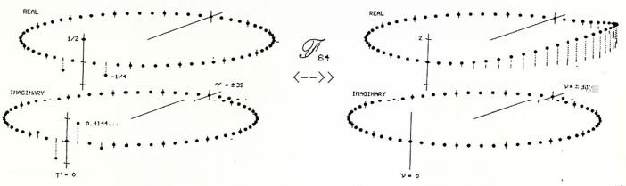

couragement. Thanks are also due Dr. John Vanderkooy and Dr. Stanley Lipshitz for their helpful discussions about windowing. Finally, I am grateful to Daniel Hirsch and the Stevenson Program on Nuclear Policy at the University of California at Santa Cruz for the use of their facilities.

## 12 REFERENCES

- [1] P. A. M. Dirac, The Principles of Quantum Mechanics, 3rd ed. (Oxford University Press, Oxford, England, 1947).
- [2] R. C. Heyser, "Determination of Loudspeaker Signal Arrival Times, Parts I, I, and III," J. Audio Eng. Soc., vol. 19, pp. 734-743 (1971 Oct.); pp. 829-834 (1971 Nov.); pp. 902-905 (1971 Dec.).
- [4] R. N. Bracewell, The Fourier Transform and Its Applications, 2nd ed. (McGraw-Hill, New York, 1978).
- [3] S. P. Lipshitz, T. C. Scott, and J. Vanderkooy, "Increasing the Audio Measurement Capability of FFT Analyzers by Microcomputer Postprocessing," J. Audio Eng. Soc., vol. 33, pp. 626-648（1985 Sept.).
- [5] A. V. Oppenheim and R. W. Schafer, Digital Signal Processing (Prentice-Hall, Englewood Cliffs, NJ, 1975).
- [6] L. R. Rabiner and B. Gold, Theory and Application of Digital Signal Processing (Prentice-Hall, Englewood Cliffs, NJ, 1975).

## APPENDIX I

It has been suggested by Heyser [2] that the analytic impulse ought to look like Fig. 24. In fact, this reference introduces two analytic impulses: one is the function discussed in this paper and the other is a function with bounded total energy. I would like to examine in a little more detail why the doublet function does not vanish for nonzero time, and explore the question of bounded energy.

In Figs. 9 and 10 we saw the analytic sinc function a sinc(t). The imaginary part of this function, cosinc(t),

Fig. 23. ETC for same tweeter as in Fig. 21, measured with tweeter mounted at end of long sound-absorbing tube; smoothing used.

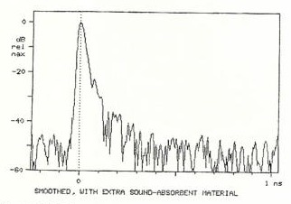

has local extrema that oscillate between O and (approximately) 2/πt. As we tend to the limit, the band edge of the spectrum moves to the right, and the extrema of the signal move closer together. At the limit, we might feel that the signal becomes infinitely discontinuous, but a property of the Fourier integral saves us. This is the property that at a discontinuity, the integral converges to the average of the left- and the right-hand limits. Thus the inverse transform of CAUS(f) has the form given in Eq. 5. The real part does converge to zero for t ≠ 0, but the imaginary part converges to the "average" value of 1/t.

Let us be more explicit about the limiting process. We are in effect expanding the frequency function, or shrinking the frequency scale, and hence expanding the time scale. If we let II(f) be the spectrum of a sinc(t), the limiting process is

$$\Delta ( t ) = \lim _ { \alpha \to 0 } \frac { 1 } { \alpha } \, \text {as} \, \left ( \frac { t } { \alpha } \right ) \, \underset { < \dots > } { \mathcal { F } } \, \lim _ { \alpha \to 0 } \, \Pi ( \alpha f ) \, , \quad ( 1 1 )$$

In the context of the theory of generalized functions, this is a rigorous definition of the analytic impulse, and its real part does converge to the familiar delta function. If we substitute a = 1/α, we get [2, eq. 35]. This function does not have unit energy. To see this, it is merely necessary to observe that the area under its spectrum (Fig. 11, right side) is infinite. One may also carry out the energy integral in the time domain to convince oneself. How then do we explain [2, eq. 32], which arrives at the opposite conclusion? A look at [2, eq. 30] will reveal that this equation has an additional 1/√a term in it. But a is the term that goes to infinity. Thus we have slipped in an additional convergence term. In this case it is correct to say that the function so defined has unit area, but at the expense of introducing a rival impulse function. Heyser [2] seems to suggest that these distinct functions are one and the same. But it is contradictory for a signal to have equal nonzero energy density at all frequencies and still have bounded total energy. To further the confusion, the comment in [2, fig. A-3] concedes that the envelope of the doublet goes as 1/t, but this is juxtaposed with a picture of the rival impulse function (the same as my Fig. 24).

Fig. 24. Essentially duplicate of [2, fig. A.3].

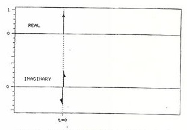

## APPENDIX II

Following are the equations used in this paper to carry out the required transforms. The continuous Fourier transforms;

$$\begin{aligned} F ( f ) & = \int _ { - \infty } ^ { \infty } f ( t ) \, e ^ { - j 2 \pi f t } \, d t \\ f ( t ) & = \int _ { - \infty } ^ { \infty } F ( f ) \, e ^ { j 2 \pi f t } \, d f \quad ( 1 2 ) \end{aligned}$$

the z transform,

$$F ( z ) \, = \, \sum _ { z } f [ \tau ] z ^ { - \tau } \, ,$$

$$f [ \tau ] = \frac { 1 } { 2 \pi j } \oint _ { \ } F ( z ) z ^ { \tau - 1 } \, d z$$

$$f [ \tau ] = \frac { 1 } { 2 \pi j } \, \oint \, F ( z ) z ^ { \tau - 1 } \, d z$$

$$F [ \nu ] = \sum _ { - N / 2 } ^ { N / 2 - 1 } f [ \tau ] \, e ^ { - j ( 2 \pi / N ) \nu \tau } \, ,$$

$$f [ \tau ] = \frac { 1 } { N } \sum _ { - N / 2 } ^ { N / 2 - 1 } f [ \nu ] \, e ^ { j ( 2 \pi / N ) \tau } \, .$$

Note that this convention for the DFT means that the area under a function squared is not the same as the area under its transform squared-a factor N must be included in the Parseval-Rayleigh formula. Alternate conventions could have a 1/√N on both sides or the 1/N on the other side. This convention makes the forward transform of a unit impulse equal to a constant spectrum of one, analogous to the continuous case.

## THE AUTHOR

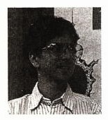

Andrew Duncan was born in London, U.K., in 1960. He received a B.S. degree in engineering and applied sciences from the California Institute of Technology in 1983. He taught high school physics for 2 years in Pasadena, California, while studying at Caltech, and for another year after graduation. He then worked for 2 years, with Marshall Buck, as a programmer at Cerwin-Vega Inc. Mr. Duncan is currently a doctoral student in mathematics at the University of California at Santa Cruz, where he is studying the application of group theory to the theory of tonal harmony. He has also worked as a consultant at E-mu Systems, Inc. in the area of digital pitch shifting.

A member of the AES and the AMS, Mr. Duncan has interests in the combination of music and mathematics. He plays the acoustic guitar, the electric bass, and the Chapman Stick, while studying the music of, respectively, John Fahey, Phil Lesh, and J.S. Bach on these instruments. His current interests include group representations of tonal and modal movement in the equally tempered scale and applications of tiling theory to fingering patterns on string instruments.
